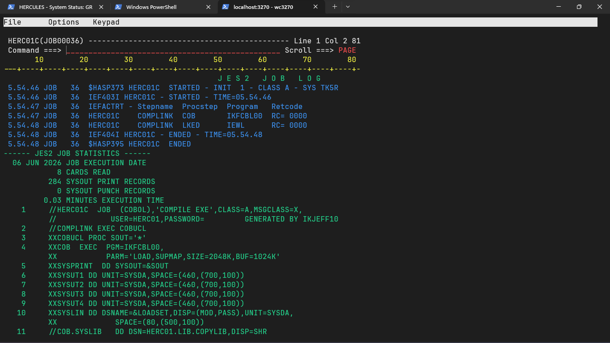
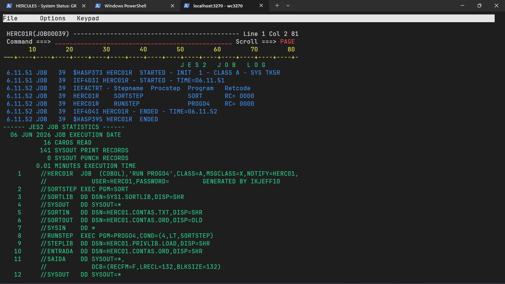
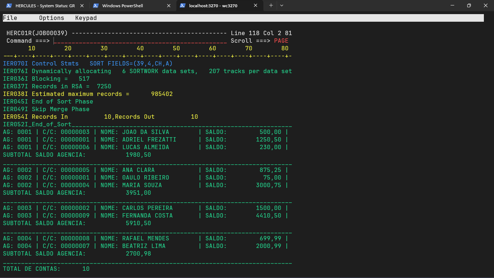

# Projeto 4 - COBOL Semana 6

## Processamento de Contas Bancárias

Projeto desenvolvido em COBOL no ambiente **TK5 / MVS 3.8J**, utilizando **JCL**, **SORT**, **JES2** e execução via **TSO**.

O objetivo do projeto é processar um arquivo de contas bancárias, ordenar os registros por agência e gerar um relatório com as informações das contas, subtotais por agência, total de contas e saldo total.

## Arquivos do projeto

```text
PROGO4.cob    Programa COBOL principal
COMPILE.JCL   JCL utilizado para compilar e link-editar o programa
EXEC.JCL      JCL utilizado para ordenar o arquivo e executar o programa
CONTAS.TXT    Arquivo de entrada com as contas bancárias
README.md     Documentação do projeto
screenshots/  Imagens da compilação, execução e saída do programa
```

## Estrutura do arquivo de entrada

O arquivo `CONTAS.TXT` contém registros de contas bancárias em formato fixo.

Layout utilizado:

```text
NUM-CONTA      8 posições
NOME-CLIENTE  30 posições
AGENCIA        4 posições
TIPO-CONTA     1 posição
SALDO         10 posições
FILLER         1 posição
```

Exemplo de registros:

```text
00000001ADRIEL FREZATTI               0001C0000125050
00000002JOAO DA SILVA                 0001P0000050000
00000003MARIA SOUZA                   0002C0000300075
```

O campo `SALDO` é armazenado sem vírgula, usando duas casas decimais implícitas:

```text
0000125050 = 1250,50
0000050000 = 500,00
0000300075 = 3000,75
```

## Ordenação dos dados

A ordenação é feita no JCL de execução usando o `SORT`.

```jcl
SORT FIELDS=(39,4,CH,A)
```

Esse comando ordena os registros pelo campo `AGENCIA`.

A posição 39 é o início do campo agência dentro do registro:

```text
NUM-CONTA      posições 1–8
NOME-CLIENTE   posições 9–38
AGENCIA        posições 39–42
TIPO-CONTA     posição 43
SALDO          posições 44–53
FILLER         posição 54
```

## Explicação do programa COBOL

O programa `PROGO4` realiza o processamento do arquivo de contas já ordenado por agência.

Principais etapas do programa:

1. Abre o arquivo de entrada e o arquivo de saída.
2. Lê os registros do arquivo ordenado.
3. Grava as informações de cada conta no relatório.
4. Acumula o total de contas.
5. Acumula o saldo total geral.
6. Calcula o subtotal de saldo por agência.
7. Fecha os arquivos ao final do processamento.

O programa usa uma lógica de quebra por agência. Como o arquivo já está ordenado pelo campo `AGENCIA`, sempre que a agência muda o programa grava o subtotal da agência anterior e inicia a contagem da nova agência.

## Exemplo de saída

```text
AG: 0001 | C/C: 00000002 | NOME: JOAO DA SILVA        | SALDO:         500,00 |
AG: 0001 | C/C: 00000001 | NOME: ADRIEL FREZATTI      | SALDO:        1250,50 |
SUBTOTAL SALDO AGENCIA:           1750,50
________________________________________________________________________________
AG: 0002 | C/C: 00000003 | NOME: MARIA SOUZA          | SALDO:        3000,75 |
SUBTOTAL SALDO AGENCIA:           3000,75
________________________________________________________________________________
TOTAL DE CONTAS:       3
SALDO TOTAL:           4751,25
```

## Resultados obtidos

A compilação foi finalizada com sucesso:

```text
HERC01C    COMPLINK  COB       IKFCBL00  RC= 0000
HERC01C    COMPLINK  LKED      IEWL      RC= 0000
```

A execução também foi finalizada com sucesso:

```text
HERC01R    SORTSTEP            SORT      RC= 0000
HERC01R    RUNSTEP             PROGO4    RC= 0000
```

## Imagens da execução

### Compilação com sucesso

Imagem mostrando o job de compilação com `RC=0000`.



### Detalhes da compilação

Imagem complementar mostrando os detalhes da compilação e link-edição.


### Execução com sucesso

Imagem mostrando o job de execução com `SORTSTEP RC=0000` e `RUNSTEP RC=0000`.



### Relatório final gerado

Imagem mostrando a saída final do programa com as contas, subtotais por agência, total de contas e saldo total.



## Observações

O projeto foi desenvolvido e testado em uma instância local do TK5.

Durante o desenvolvimento, o programa foi ajustado para manter compatibilidade com o compilador COBOL antigo disponível no ambiente TK5. Por isso, o código evita recursos de COBOL mais moderno e utiliza uma estrutura compatível com o ambiente mainframe usado na atividade.

## Autor

Adriel Frezatti
